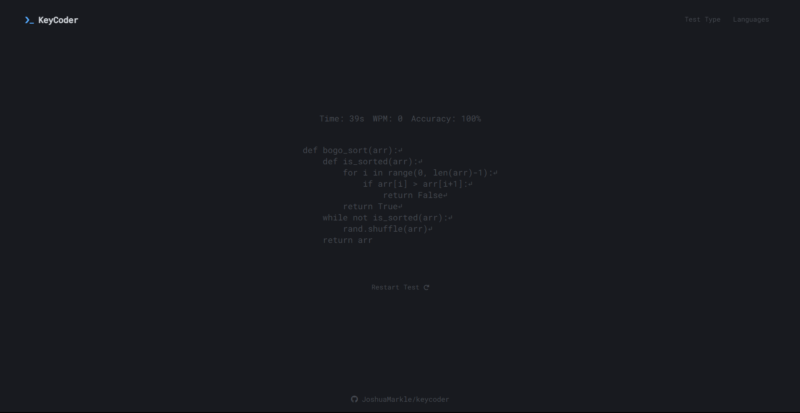

[AlgoType](https://algotype.net/) is a specialized typing website **designed for programmers** who want to enhance their coding fluency. It offers a minimalistic experience to practice typing the difficult symbols when coding. 😎

## Features

- **Algorithms Gamemode:** Exercises include a variety of code snippets in different programming languages
- **Words Gamemode:** A unique arrangement of words from the language of your choice
- **Minimalistic Design:** A clutter-free environment that lets you focus on improving your typing skills
- **5 Supported Languages** and counting!
- **Complied Stats:** WPM, Accuracy, and Time Passed

## Future Goals

- Support for more programming languages
- Comprehensive set of algorithms, with an explaination and use case after the typing test. Also a link to learn more about that algorithm
- Account system for saving stats
- Something similar to [vim-be-good](https://github.com/ThePrimeagen/vim-be-good). A way for programmers to practice vim movements and commands

## Credits

This website was largely inspired by [monkeytype.com](https://github.com/monkeytypegame/monkeytype) with its minimal theme and natural typing experience.

Happy Coding & Typing! 😄