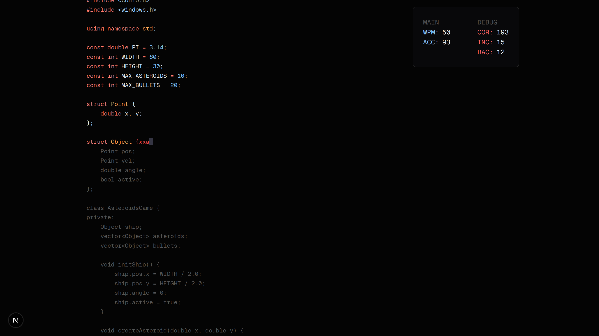
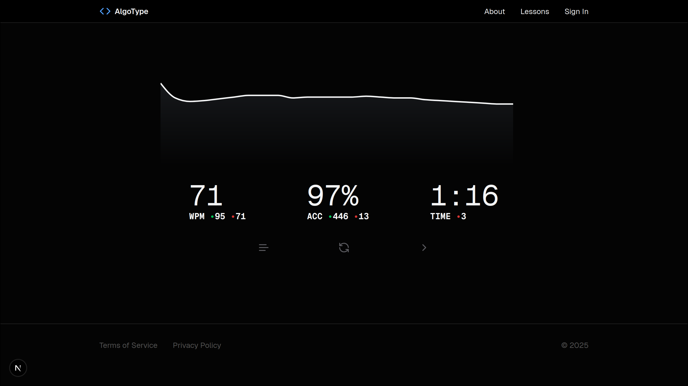

	

AlgoType is a versatile [typing test](https://algotype.net/) **designed for programmers** who want to take their programming speed to the next level. It offers a minimalistic experience to practice typing symbols that don't get enough practice.

Happy coding && typing
