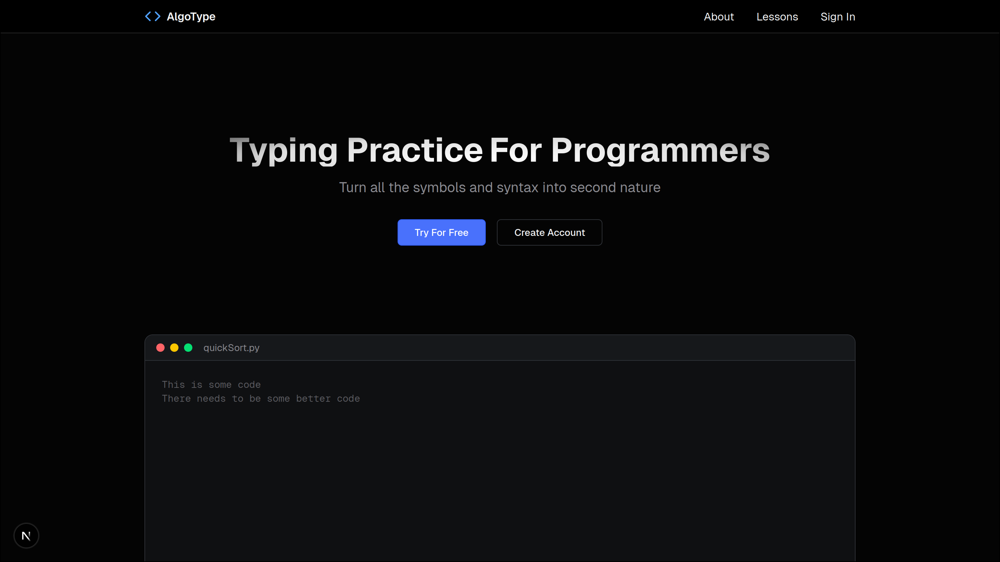
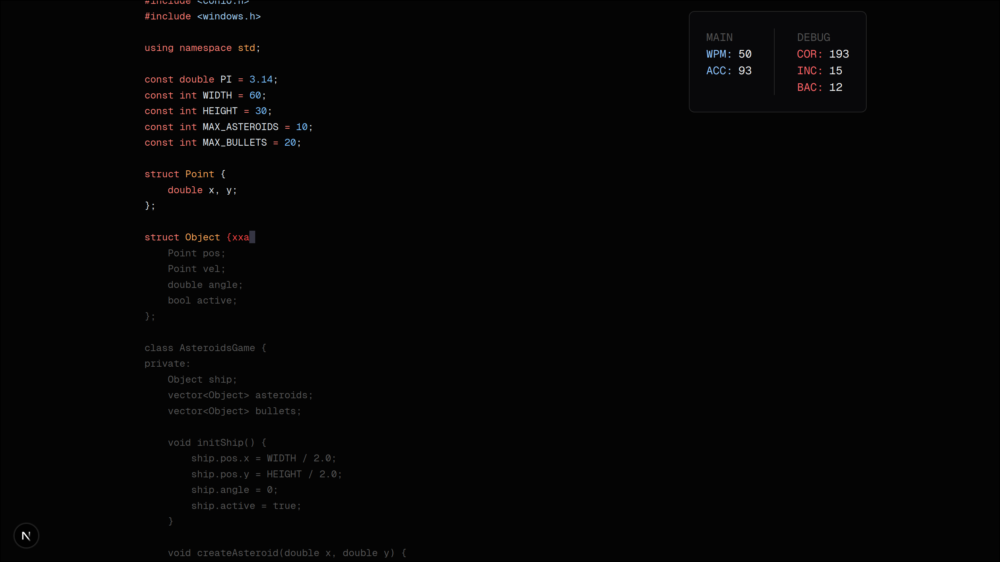
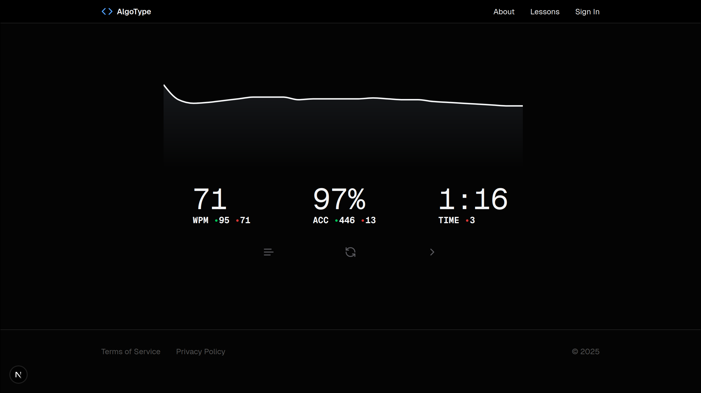

	

AlgoType.net is an awesome [typing website](https://algotype.net/) <ins>designed for programmers</ins> who want to take their programming speed to the next level. It offers a minimalistic experience to practice typing symbols that don't get enough time under the fingers.

The website is <ins>completely free</ins> to use and creating an account allows users to track their progress.

# ✨ Features

- ⌨️ Typing System
    - Robust code token system (syntax-aware typing)
    - Realtime stats like wpm, accuracy, and errors
    - Interactive charts and graphs
    - Minimalistic, functional design
- 👾 Gamemodes
    - Algorithms: type out thousands of popular algorithms (leetcode solutions)
    - Files: type the implementations of software features (larger files)
    - Syntax Drills: practice certain language features - repeated for loops, functions, classes (micro)
    - Timed: 15s/30s/60s code sprints
- 🎨 Themes for the site and syntax highlighting (Dracula, Gruvbox, Nord, Catppuccin, ...)
- 👤 Account System
    - Track past tests + progress
    - Language/theme preferences saved to your account
    - Sign in with email, GitHub or Google (Supabase auth)
- ➕ And much more!

# 📄 License

This software is licensed under the PolyForm Shield License 1.0.0. For details, see the [LICENSE.md](LICENSE.md).

> [!NOTE]
> Currently, this code is licensed as software-available with plans to transition to a open-source licnese in the future.

---

Happy coding <code>&&</code> typing

