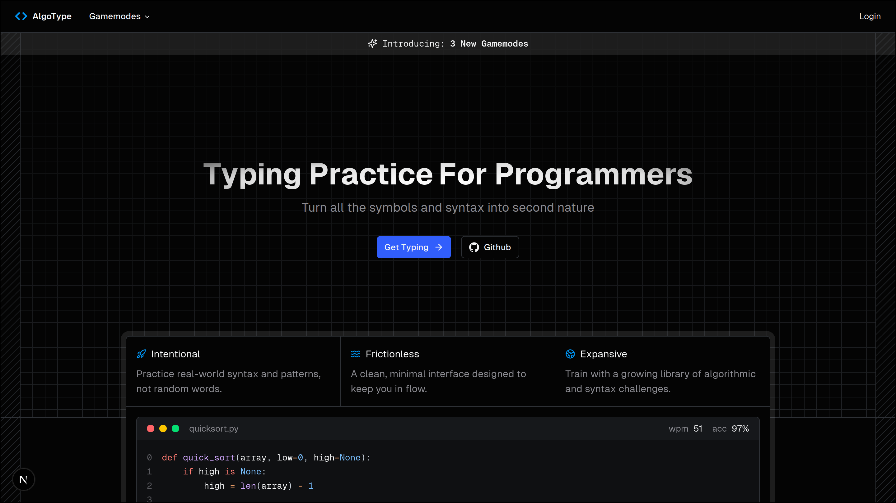

	

AlgoType.net is a versatile [typing test](https://algotype.net/) **designed for programmers** who want to take their programming speed to the next level. It offers a minimalistic experience to practice typing symbols that don't get enough practice.

# ✨ (Intended) Features

- ⌨️ Typing System
    - Robust code token system (syntax-aware typing)
    - Realtime stats like wpm, accuracy, and errors
    - Minimalistic design
- 👾 Gamemodes
    - Files: type entire files - implementations of some large feature (larger)
    - Algorithms: type out popular algorithms - like leetcode solutions (smaller)
    - Syntax Drills: practice certain language features - repeated for loops (micro)
    - Timed: 15s/30s/60s code sprints
- 👤 Account System
    - Track past tests + progress
    - Save language/theme preferences
    - Secured with Supabase
- ➕ And much more!

---

Happy coding <code>&&</code> typing

