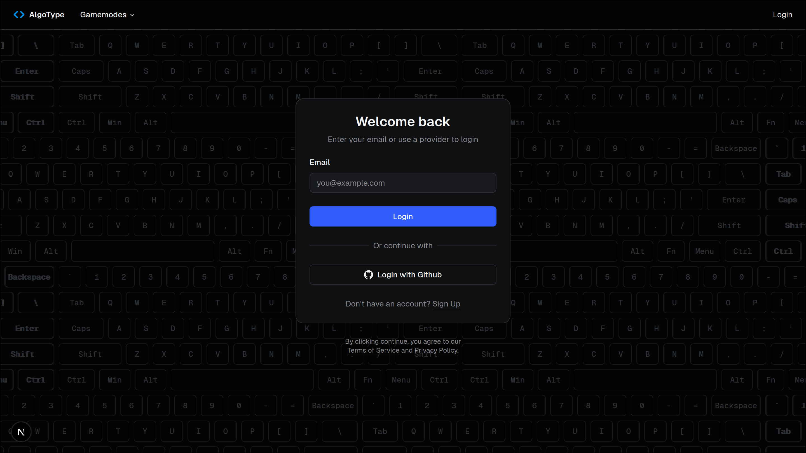

	

AlgoType.net is an awesome [typing website](https://algotype.net/) <ins>designed for programmers</ins> who want to take their programming speed to the next level. It offers a minimalistic experience to practice typing symbols that don't get enough time under the fingers.

The website is <ins>completely free</ins> to use and creating an account allows users to track their progress.

# ✨ Features

- ⌨️ Typing System
    - Robust code token system (syntax-aware typing)
    - Realtime stats like wpm, accuracy, and errors
    - Interactive charts and graphs
    - Minimalistic, functional design
- 👾 Gamemodes
    - Algorithms: type out over 7000 popular algorithms (leetcode solutions)
    - Features: type the implementations of software feature (larger files)
    - [TODO] Syntax Drills: practice certain language features - repeated for loops (micro)
    - [TODO] Timed: 15s/30s/60s code sprints
- 👤 Account System
    - Track past tests + progress
    - [TODO] Save language/theme preferences
    - Secured with Supabase + GitHub auth
- ➕ And much more!

---

Happy coding <code>&&</code> typing

