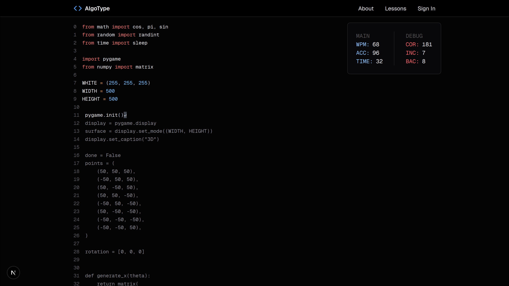

<div align="center">
	
</div>


AlgoType.net is a versatile [typing test](https://algotype.net/) **designed for programmers** who want to take their programming speed to the next level. It offers a minimalistic experience to practice typing symbols that don't get enough practice.




# (Intended) Features

- ⌨️ Typing System
    - Robust code token system (syntax-aware typing)
    - Realtime stats like wpm, accuracy, and errors
    - Minimalistic design
- 👾 Gamemodes
    - Files: type entire files - implementations of some large feature (larger)
    - Algorithms: type out popular algorithms - like leetcode solutions (smaller)
    - Syntax Drills: practice certain language features - repeated for loops (micro)
    - Timed: 15s/30s/60s code sprints
- 👤 Account System
    - Track past tests + progress
    - Save language/theme preferences
- And much more!

# 🔨 Development

## 🧱 Project Structure

```python
src                 # frontend
├── app             # entry point
│   └── lessons     # lesson homepage
│       └── [slug]  # dynamic typing test
├── components      # reusable components
│   ├── typingtest  # typing test stuff
│   └── ui          # ui stuff
├── utils           # utilities
└── lib             # libraries (or should I call this util?)
    └── supabaseClient.js

backend             # backend
├── data            # data
│   ├── files       # code files (group by language)
│   │   ├── python
│   │   ├── javascript
│   │   └── cpp
│   ├── algorithms  # code files (group by language)
│   ├── syntax      # code files (group by language)
│   └── tokens      # generated tokens (optional output)
└── scripts         # generate + push tokens
    ├── generateTokens.js
    └── uploadToSupabase.js
```

- Frontend is stored in `src/`
    - Contains all react pages/components
    - Utilities to connect to database + authentication
- Backend is stored in `backend/`
    - Have a sorted directory of files for each gamemode (files/algorithms/syntax)
        - Each gamemode is sorted by language
        - Each gamemode have build step -> generate tokens for that gamemode
            - Tokens contain file information + code tokens
    - Scripts to generate tokens + upload tokens to database

---

<div align="center">Happy coding && typing</div>
